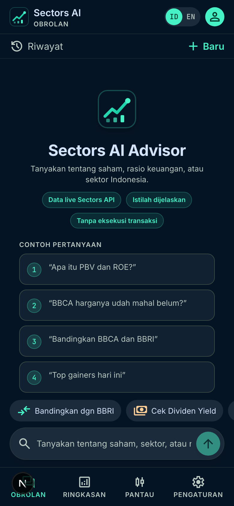
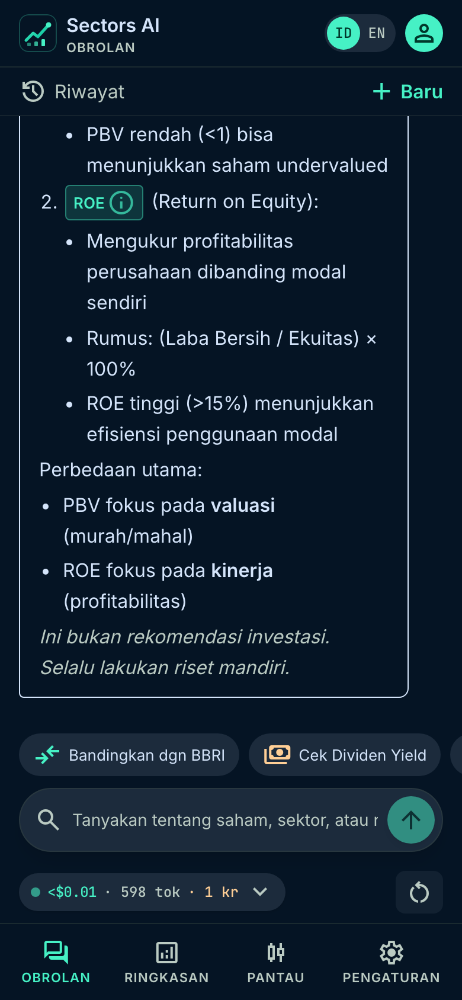
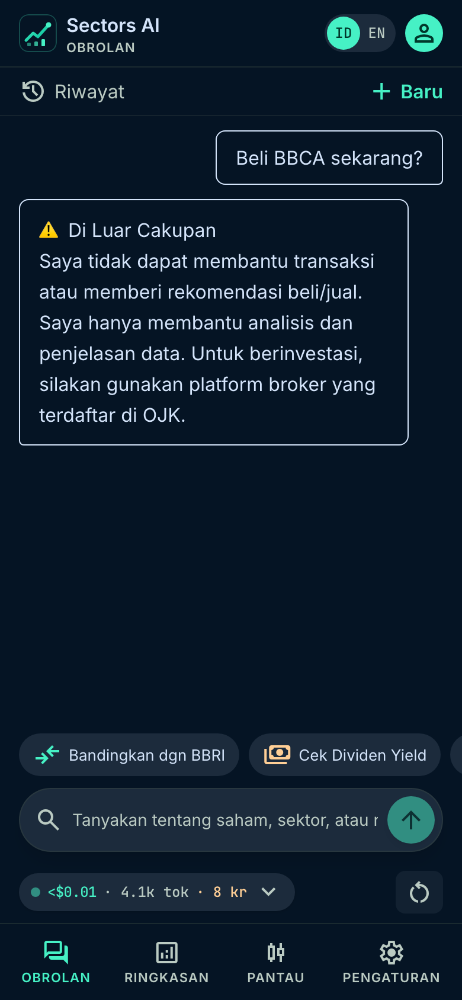
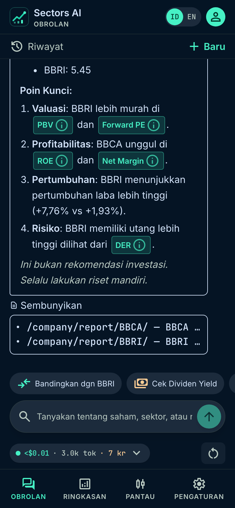
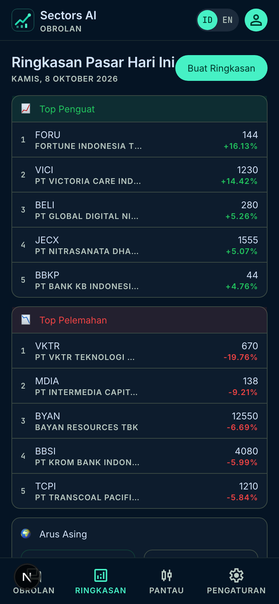
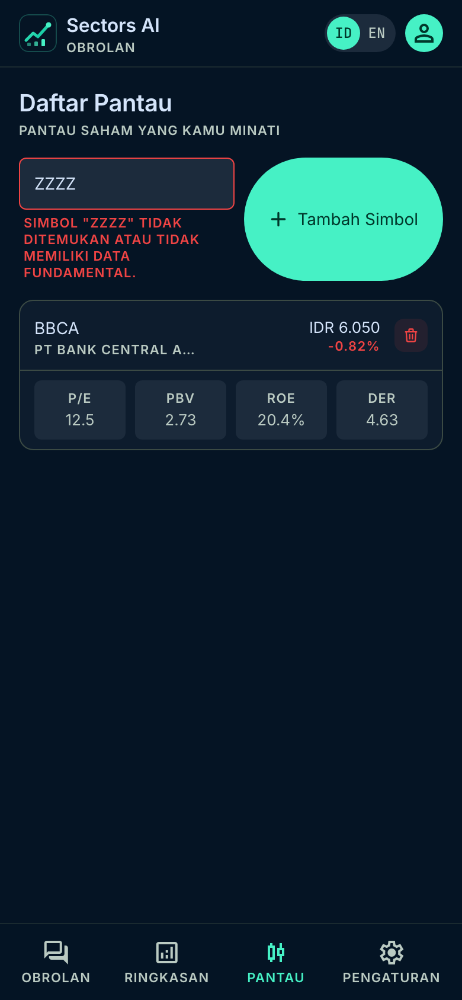

# Sectors AI Advisor

**Sectors Hackathon 2026 · Track 1: AI Agents & Assistants**

**Team:** cobacobaberhadiah · **Member:** Muhamad Septian Pamungkas

AI-powered investment assistant for Indonesian retail investors. Translates complex IDX market data from the **Sectors API v2** into plain-language insights with in-line glossary chips, source citations on every answer, daily market briefs, watchlist tracking and conversation history.

---

## 🚀 Quick Start

### 1. Clone & Install

```bash
git clone https://github.com/seppam/sectors-ai-advisor.git
cd sectors-ai-advisor
npm install
```

Requires Node.js 20+.

### 2. Configure Environment

Copy the example env file and fill in your API keys:

```bash
cp .env.local.example .env.local
```

Edit `.env.local` with your keys:

```env
# Sectors API Key (optional server fallback; get yours at https://sectors.app)
SECTORS_API_KEY=your_sectors_api_key_here

# LLM Provider Keys (optional — only for the server-side /api/chat proxy; the UI uses the key from Settings)
ANTHROPIC_API_KEY=your_anthropic_key_here
OPENAI_API_KEY=your_openai_key_here
DEEPSEEK_API_KEY=your_deepseek_key_here
OPENROUTER_API_KEY=your_openrouter_key_here
```

> 💡 **How keys are used:** the app's default flow uses the keys you enter in **Settings** (stored only in your browser's localStorage). The LLM key goes straight from the browser to your provider; Sectors requests go through the app's stateless `/api/sectors` proxy because `api.sectors.app` does not allow cross-origin browser calls. Nothing is stored server-side. `SECTORS_API_KEY` in `.env.local` is only a fallback for the proxy when no key is sent, and the `QA_*` variables are used by `scripts/qa-live.mjs` only.

### 3. Run

```bash
npm run dev
# Open http://localhost:3000
```

### Build for Production

```bash
npm run build
npm start
```

---

## ⚙️ API Key Setup (In-App)

Open the **Settings** tab and enter your keys:

| Service | Where to get it |
|---|---|
| **Sectors API** | https://sectors.app/api *(requires Sectors Insider plan)* |
| **Anthropic Claude** | https://console.anthropic.com/settings/keys |
| **OpenAI GPT-4o** | https://platform.openai.com/api-keys |
| **DeepSeek V3** | https://platform.deepseek.com/api-docs/api |
| **OpenRouter** | https://openrouter.ai/sign-up *(gateway for 500+ models)* |
| **nexotao** | https://nexotao.com *(Indonesian gateway, IDR pricing)* |

Quick-fill presets for common setups:
- 📡 OpenRouter + DeepSeek V3
- 🤖 OpenRouter + Claude Sonnet 4
- 🏠 LM Studio (local, port 1234)
- 🇮🇩 nexotao + DeepSeek

Supports any **OpenAI-compatible gateway** — OpenRouter, nexotao, Azure OpenAI, LM Studio, Ollama, and more.

---

## ✨ Features

### 💬 Chat Interface
- Ask questions in Bahasa Indonesia or English
- Sectors API data fetched live as context for the LLM
- In-line **[TERM] chips** — click any financial term to see it explained in a slide-up glossary panel
- Guardrails: blocks trade execution requests, crypto/forex queries, price predictions
- Rendered Markdown answers (lists, bold, tables) and a **conversation history** drawer with auto-generated titles
- Financial disclaimer on every response
- Data citation panel (shows which Sectors API endpoints were used)

### 📊 Daily Market Brief
- Generates a plain-language daily market summary
- Pulls: top gainers, top losers, foreign investor net flow, latest news
- Rendered as a formatted card with AI-generated analysis

### 📋 Watchlist
- Add stocks by ticker symbol (e.g. BBCA, BBRI, TLKM)
- Shows key metrics: P/E, PBV, ROE, DER, Dividend Yield

### ⚙️ Settings
- API key management with credit balance checker
- LLM provider switcher (Claude / GPT-4o / DeepSeek / Custom)
- Language toggle (ID / EN)
- Reset all data

---

## 🛡️ Guardrails

The bot enforces these rules on every query:

| Intent | Example triggers | Response |
|---|---|---|
| Transactions / buy-sell advice | `beli`, `jual`, `buy`, `sell`, `target harga`, `stop loss` | Declines; points to an OJK-registered broker |
| Price prediction | `prediksi harga`, `akan naik`, `besok`, `next week` | Declines to predict; offers historical/fundamental analysis |
| Non-IDX markets | `crypto`, `bitcoin`, `forex`, `saham usa` | Explains the IDX-only scope |

Guardrails run **before** any API call, so blocked requests cost no Sectors credits or LLM tokens.

---

## 📁 Project Structure

```
src/
├── app/
│   ├── (app)/                 # Route group — shares MainShell layout
│   │   ├── chat/page.tsx      # Main chat interface
│   │   ├── daily-brief/       # Daily market brief
│   │   ├── watchlist/         # Watchlist tracker
│   │   └── settings/          # API key & preferences
│   ├── landing/page.tsx       # Landing / marketing page
│   ├── onboarding/page.tsx    # 4-step onboarding flow
│   ├── api/
│   │   ├── chat/route.ts      # LLM proxy (keys stay server-side)
│   │   ├── brief/route.ts     # Daily brief proxy
│   │   ├── sectors/route.ts   # Sectors API proxy
│   │   └── debug/guardrail/   # Dev-only guardrail tester
│   └── page.tsx               # Root → redirects to /chat
├── components/
│   ├── ui/                    # Stitch design system components
│   ├── chat/                  # Chat-specific components
│   ├── layout/                # TopBar, BottomNav, PageContainer
│   ├── MainShell.tsx          # App shell (nav + content)
│   └── GlossaryPanel.tsx      # Slide-up glossary panel
└── lib/
    ├── types.ts               # TypeScript types
    ├── store.ts               # Zustand + localStorage state
    ├── sectorsApi.ts          # Sectors REST API client
    ├── llmProviders.ts        # Anthropic / OpenAI / DeepSeek abstraction
    ├── optimizedPrompts.ts    # Prompt builder with token budgeting
    ├── usageTracker.ts        # Token usage & Sectors credit tracking
    ├── glossary.ts            # Financial terms glossary (central source)
    ├── i18n.ts                # ID/EN string translations
    └── apiCache.ts            # In-memory response cache
```

---

## 🏗️ Architecture

```
User query (Bahasa / English)
    ↓
Guardrail check (word-boundary regex blocklist)
    ↓
Sectors API → fetches relevant data (screener, company report, top movers, news)
    ↓
LLM (Claude / GPT-4o / DeepSeek / OpenAI-compatible)
  System prompt: role + glossary + guardrails + disclaimer rules
  User prompt: query + Sectors data + glossary terms + conversation history
    ↓
Response rendered with [TERM:slug:label] chips → interactive glossary
    ↓
Disclaimer enforced by the system prompt (no post-hoc string appending)
```

**API routes** (`/api/chat`, `/api/brief`, `/api/sectors`) are optional server-side proxies that read keys from `.env.local`. The default UI flow calls the providers directly from the browser with the keys saved in Settings.

---

## 🌐 Deploy to Vercel

1. Push to GitHub
2. Go to [vercel.com](https://vercel.com) → New Project → Import from GitHub
3. Add environment variables in Vercel dashboard:
   - `SECTORS_API_KEY`
   - `ANTHROPIC_API_KEY` (and/or `OPENAI_API_KEY`, `DEEPSEEK_API_KEY`, `OPENROUTER_API_KEY`)
4. Deploy — Vercel auto-detects Next.js
5. Add your Vercel URL to Settings → Custom Base URL (optional)

---

## 📸 Screenshots

Captured from the verified live QA run (390×844) — see [`docs/QA-REPORT.md`](docs/QA-REPORT.md).

| Welcome | Answer + term chips | Guardrail |
|---|---|---|
|  |  |  |

| Compare + sources | Daily brief | Watchlist |
|---|---|---|
|  |  |  |

---

## 🧪 Testing

```bash
npx playwright install chromium
npx playwright test                 # 28 e2e tests (no API keys needed)
node scripts/qa-live.mjs            # live 10-flow QA + screen recording (needs QA_* keys in .env.local)
```

---

## 🎬 Demo Videos

| Video | Link |
|---|---|
| 1-minute teaser | https://youtu.be/K4uEjemUpfo |
| 3-minute judging video (demo + technical walkthrough) | https://youtu.be/bpj0dAYByU0 |

---|---|
| 1-minute teaser | https://youtu.be/K4uEjemUpfo |
| 3-minute judging video (demo + technical walkthrough) | https://youtu.be/bpj0dAYByU0 |

Video source (Remotion compositions, narration script, VO generator) lives in [`/video`](video); rendered `.mp4`/`.mp3` files are not committed.

---

## 🎯 Submission

**Sectors Hackathon 2026 · Track 1: AI Agents & Assistants** — deadline 8 October 2026, 23:59 WIB.
Repository: https://github.com/seppam/sectors-ai-advisor

---

## 📝 Problem Statement

> Dirancang untuk investor ritel Indonesia yang kesulitan memahami data pasar IDX (PER, PBV, ROE, DER), Sectors AI Advisor adalah asisten AI berbahasa Indonesia yang mengambil data live dari Sectors API, menjelaskan istilah keuangan secara in-line, dan menolak permintaan transaksi maupun prediksi harga.

---

## 📝 Notes

- Sectors API credits: most endpoints cost **1 credit** per call
- The LLM is abstracted behind a provider interface — swap providers in Settings with no code changes
- **No automated trade execution** — the app analyzes and explains data only
- Guardrail debug endpoint (`/api/debug/guardrail`) is blocked in production
