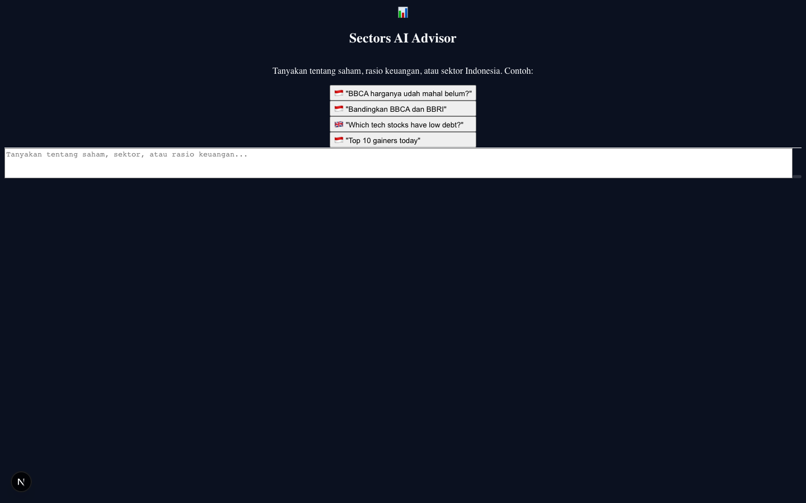
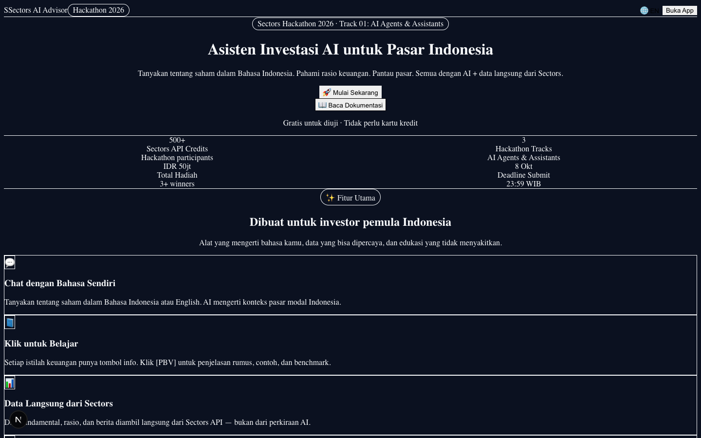
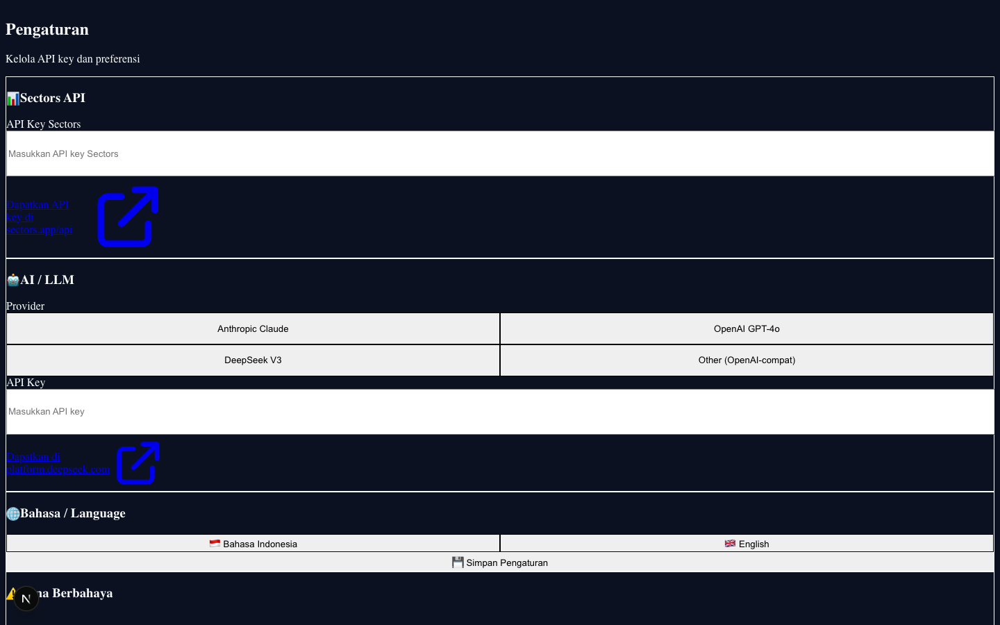
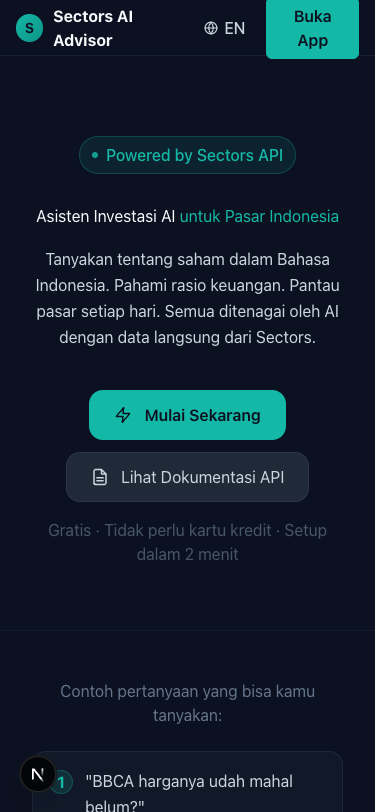

# Sectors AI Advisor

**Sectors Hackathon 2026 · Track 1: AI Agents & Assistants**

AI-powered investment assistant for Indonesian retail investors. Translates complex IDX market data into plain-language insights with in-line glossary chips, daily market briefs, and watchlist tracking.

---

## 🚀 Quick Start

### 1. Clone & Install

```bash
npm install
```

### 2. Configure Environment

Copy the example env file and fill in your API keys:

```bash
cp .env.local.example .env.local
```

Edit `.env.local` with your keys:

```env
# Sectors API Key (get yours at https://sectors.app — requires Insider plan)
SECTORS_API_KEY=your_sectors_api_key_here

# LLM Provider Keys (at least one required)
ANTHROPIC_API_KEY=your_anthropic_key_here
OPENAI_API_KEY=your_openai_key_here
DEEPSEEK_API_KEY=your_deepseek_key_here
OPENROUTER_API_KEY=your_openrouter_key_here
```

> 💡 **Keys set in `.env.local` stay server-side** — they are read by Next.js API routes and never exposed to the browser. Alternatively, keys can be entered in the app's Settings UI (stored in browser localStorage for convenience).

### 3. Run

```bash
npm run dev
# Open http://localhost:3000
```

### Build for Production

```bash
npm run build
npm start
```

---

## ⚙️ API Key Setup (Alternative: In-App)

If you prefer not to use `.env.local`, open the **Settings** tab and enter keys directly:

| Service | Where to get it |
|---|---|
| **Sectors API** | https://sectors.app/api *(requires Sectors Insider plan)* |
| **Anthropic Claude** | https://console.anthropic.com/settings/keys |
| **OpenAI GPT-4o** | https://platform.openai.com/api-keys |
| **DeepSeek V3** | https://platform.deepseek.com/api-docs/api |
| **OpenRouter** | https://openrouter.ai/sign-up *(gateway for 500+ models)* |
| **nexotao** | https://nexotao.com *(Indonesian gateway, IDR pricing)* |

Quick-fill presets for common setups:
- 📡 OpenRouter + DeepSeek V3
- 🤖 OpenRouter + Claude Sonnet 4
- 🏠 LM Studio (local, port 1234)
- 🇮🇩 nexotao + DeepSeek

Supports any **OpenAI-compatible gateway** — OpenRouter, nexotao, Azure OpenAI, LM Studio, Ollama, and more.

---

## ✨ Features

### 💬 Chat Interface
- Ask questions in Bahasa Indonesia or English
- Sectors API data fetched live as context for the LLM
- In-line **[TERM] chips** — click any financial term to see it explained in a slide-up glossary panel
- Guardrails: blocks trade execution requests, crypto/forex queries, price predictions
- Financial disclaimer on every response
- Data citation panel (shows which Sectors API endpoints were used)

### 📊 Daily Market Brief
- Generates a plain-language daily market summary
- Pulls: top gainers, top losers, foreign investor net flow, latest news
- Rendered as a formatted card with AI-generated analysis

### 📋 Watchlist
- Add stocks by ticker symbol (e.g. BBCA, BBRI, TLKM)
- Shows key metrics: P/E, PBV, ROE, DER, Dividend Yield
- Add from chat using the watchlist feature

### ⚙️ Settings
- API key management with credit balance checker
- LLM provider switcher (Claude / GPT-4o / DeepSeek / Custom)
- Language toggle (ID / EN)
- Reset all data

---

## 🛡️ Guardrails

The bot enforces these rules on every query:

| Keyword Pattern | Response |
|---|---|
| `beli`, `jual`, `order`, `buy`, `sell` | "I cannot help with transactions. Please use an OJK-registered broker." |
| `crypto`, `bitcoin`, `forex` | "I focus on IDX-listed Indonesian stocks only." |
| `prediksi`, `forecast`, `akan naik` | "I cannot predict future prices. I can analyze historical data." |

---

## 📁 Project Structure

```
src/
├── app/
│   ├── (app)/                 # Route group — shares MainShell layout
│   │   ├── chat/page.tsx      # Main chat interface
│   │   ├── daily-brief/       # Daily market brief
│   │   ├── watchlist/         # Watchlist tracker
│   │   └── settings/          # API key & preferences
│   ├── landing/page.tsx       # Landing / marketing page
│   ├── onboarding/page.tsx    # 4-step onboarding flow
│   ├── api/
│   │   ├── chat/route.ts      # LLM proxy (keys stay server-side)
│   │   ├── brief/route.ts     # Daily brief proxy
│   │   ├── sectors/route.ts   # Sectors API proxy
│   │   └── debug/guardrail/   # Dev-only guardrail tester
│   └── page.tsx               # Root → redirects to /chat
├── components/
│   ├── ui/                    # Stitch design system components
│   ├── chat/                  # Chat-specific components
│   ├── layout/                # TopBar, BottomNav, PageContainer
│   ├── MainShell.tsx          # App shell (nav + content)
│   └── GlossaryPanel.tsx      # Slide-up glossary panel
└── lib/
    ├── types.ts               # TypeScript types
    ├── store.ts               # Zustand + localStorage state
    ├── sectorsApi.ts          # Sectors REST API client
    ├── llmProviders.ts        # Anthropic / OpenAI / DeepSeek abstraction
    ├── optimizedPrompts.ts    # Prompt builder with token budgeting
    ├── usageTracker.ts        # Token usage & Sectors credit tracking
    ├── glossary.ts            # Financial terms glossary (central source)
    ├── i18n.ts                # ID/EN string translations
    └── apiCache.ts            # In-memory response cache
```

---

## 🏗️ Architecture

```
User query (Bahasa / English)
    ↓
Guardrail check (word-boundary regex blocklist)
    ↓
Sectors API → fetches relevant data (screener, company report, top movers, news)
    ↓
LLM (Claude / GPT-4o / DeepSeek / OpenAI-compatible)
  System prompt: role + glossary + guardrails + disclaimer rules
  User prompt: query + Sectors data + glossary terms + conversation history
    ↓
Response rendered with [TERM:slug:label] chips → interactive glossary
    ↓
Disclaimer appended automatically
```

**API routes** (`/api/chat`, `/api/brief`, `/api/sectors`) act as secure proxies — LLM and Sectors API keys are read from `.env.local` server-side and never exposed to the browser.

---

## 🌐 Deploy to Vercel

1. Push to GitHub
2. Go to [vercel.com](https://vercel.com) → New Project → Import from GitHub
3. Add environment variables in Vercel dashboard:
   - `SECTORS_API_KEY`
   - `ANTHROPIC_API_KEY` (and/or `OPENAI_API_KEY`, `DEEPSEEK_API_KEY`, `OPENROUTER_API_KEY`)
4. Deploy — Vercel auto-detects Next.js
5. Add your Vercel URL to Settings → Custom Base URL (optional)

---

## 📸 Screenshots

| Chat Interface | Landing Page |
|---|---|
|  |  |

| Settings | Mobile View |
|---|---|
|  |  |

---

## 🎯 Submission Requirements

- [x] Public GitHub repository
- [ ] **1-minute teaser video** — highlight the key feature or user flow
- [ ] **3-minute judging video** — problem → demo → technical walkthrough
- [ ] **Problem statement** (one sentence): _[WRITE YOUR OWN — see draft below]_
- [ ] **Social media post** (Instagram/LinkedIn/Threads/TikTok) tagging @Sectors: _[WRITE YOUR OWN — see draft below]_

**Deadline:** 8 October 2026 at 23:59 WIB

---

## 📝 Draft: Problem Statement

> Indonesian retail investors struggle to interpret complex IDX market data (P/E, PBV, ROE, DER) and often rely on speculation instead of data-driven analysis. Sectors AI Advisor bridges this gap with a chat interface that fetches live Sectors API data, explains financial terms in-line, and delivers a daily market brief — all in Bahasa Indonesia.

---

## 📝 Draft: Social Media Post

> 🔍📊 Investasinya tapi bingung baca laporan keuangan?
>
> Sectors AI Advisor帮咱们印尼散户解决这个痛点!
>
> ✅ Tanya soal saham dalam Bahasa Indonesia
> ✅ Langsung dapat data live dari Sectors API
> ✅ Istilah keuangan解释in-line (PBV, P/E, ROE, DER)
> ✅ Daily market brief otomatis
>
>-built untuk Sectors Hackathon 2026.
> Cek demo: [YOUR_VERCEL_URL]
>
> #SectorsHackathon2026 #IndonesiaStocks #AIInvesting

---

## 📝 Notes

- Sectors API credits: most endpoints cost **1 credit** per call
- The LLM is abstracted behind a provider interface — swap providers in Settings with no code changes
- **No automated trade execution** — the app analyzes and explains data only
- Guardrail debug endpoint (`/api/debug/guardrail`) is blocked in production
